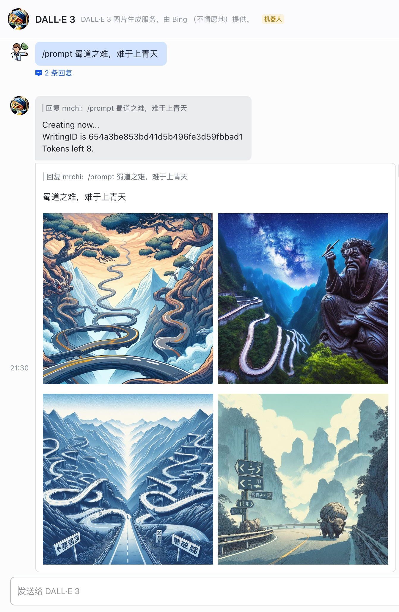

# lark-dalle3-bot

This bot integrates with Feishu/Lark and generates images utilizing the [Image Creator from Microsoft Bing](https://www.bing.com/images/create) service.



## Usage

- **/balance**: Query token balance.
- **/prompt \<Your prompt\>**: Generate images.
- **/help**: Display help information.

## Deployment

### Running the Bot with Default Configurations

To make your bot accessible online, you can leverage services like [ngrok](https://ngrok.com/) or [Cloudflare Tunnel](https://www.cloudflare.com/products/tunnel/).

1. Compile the bot:
    ```bash
    go build .
    ```
2. Initiate a config file from the provided template and modify the `lark_event_server_addr` as needed:
    ```bash
    cp config.example.json config.json
    ```
3. Execute the program:
    ```bash
    ./lark-dalle3-bot
    ```

This step ensures that the server is reachable when setting up event subscriptions soon.

### Creating a Feishu/Lark Bot Application

1. On the [Feishu Open Platform](https://open.feishu.cn/app), start by creating a custom app.
2. In menu `Add features`, activate the `Bot` feature.
3. In menu `Permissions & Scopes`, add the following `API Scopes`:
    - `im:message`
    - `im:resource`
    - `im:message.group_at_msg:readonly`
    - `im:message.p2p_msg:readonly`
4. In menu `Event Subscriptions`:
    1. Enter your bot server's address as the `Request URL`.
    2. Add the `im.message.receive_v1` event.
    3. Grant these permissions to the new event:
        - `Obtain private messages sent to the bot`
        - `Obtain group messages mentioning the bot`
5. Publish your app through the `Version Management & Release` tab.

**For Lark users, please visit [Lark Open Platform](https://open.larksuite.com/app).**

### Bot Configuration and Restart

From the Feishu/Lark Open Platform:
1. Acquire the `App ID` and `App Secret` from menu`Credentials & Basic Info`.
2. Acquire the `Encrypt Key` and `Verification Token` from menu`Event Subscriptions`.

From Bing:
1. Follow the instructions in the README at [yihong0618/BingImageCreator](https://github.com/yihong0618/BingImageCreator) to obtain your Bing cookie.

**Only for Lark users, please set `is_feishu` to `false` in config file.**

Update your `config.json` with these credentials, then rerun your bot.

Enjoy the bot's functionality.

## Related works

- [mrchi/bing\-dalle3: Golang implementation of yihong0618/BingImageCreator](https://github.com/mrchi/bing-dalle3)

## Acknowledgments

- [yihong0618/tg_bing_dalle: A Telegram bot for DALL-E 3 with Bing](https://github.com/yihong0618/tg_bing_dalle/)
- [yihong0618/BingImageCreator: High-quality image generation by Microsoft's reverse-engineered API.](https://github.com/yihong0618/BingImageCreator)

## Disclaimer

> Translated by GPT4.

If you use this project for services open to the public in China, you are required to comply with the relevant laws and regulations, and you may need to obtain the necessary permits or complete relevant procedures. This project is only for technical communication and does not assume responsibility for any legal risks that may arise during your use.
